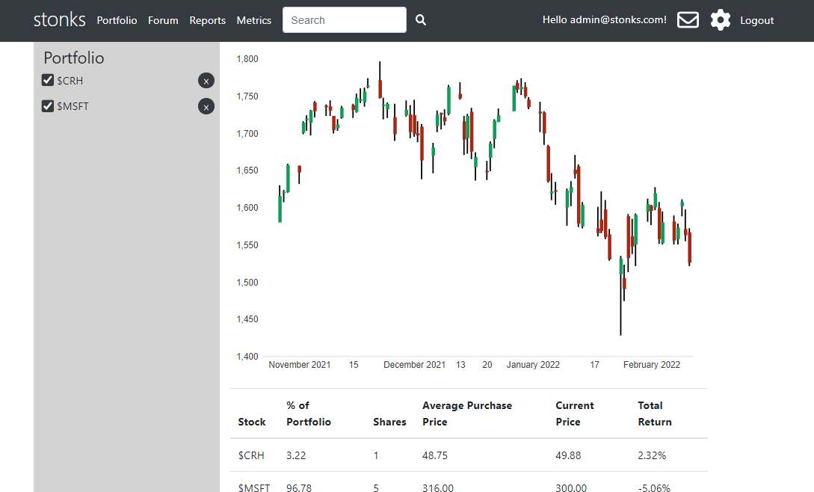

# stonks
A web application that allows users to track stocks

## Website
- https://stonks.azurewebsites.net/
- Hosted on azure, give it a second to load
- Database is Microsoft SQL Server

## Features
- Users can track stocks in their portfolio
- Forum
- Messaging between users
- Report functionality
- Metrics for admins

## How To Use
- Create an account, search for stocks using the searchbar and add them to your portfolio

## Stock Data
- Stock data is from September 24th 2021 to February 15th 2022
